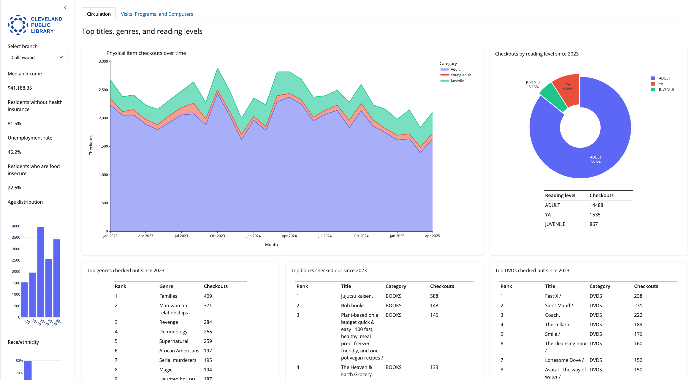

# Visualizing library statistics in a Shiny for Python app

A Shiny for Python dashboard presenting an interactive data-driven report for CPL branch managers, enabling them to monitor branch-specific performance and community demographics. The app consolidates data from multiple sources to provide insights into visits, circulation trends, program attendance, computer usage, and neighborhood socioeconomic conditions such as income, food insecurity, and unemployment (based on U.S. Census data and Map the Meal Gap data). It leverages data wrangling with pandas, interactive visualizations using Plotly, and reactive programming for real-time updates based on user input. By presenting top circulating titles, reading levels, and demographic breakdowns, the tool helps managers tailor services and programming to local community needs. Ultimately, this dashboard supports data-informed decision-making and resource discussions across CPL branches.

